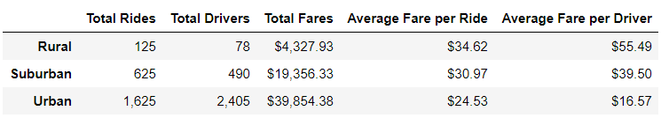

# PyBer_Analysis

## Project Overview

The analysis of PyBer ride share data was performed to determine the following metrics regarding 1) ***Urban***, 2) ***Suburban*** and 3) ***Rural cities***: 

  - a) Total rides for each city type
  - b) Total drivers for each city type
  - c) Total fares for each city type
  - d) Average fare per ride each city type
  - e) Average fare per driver each city type

This analysis will also be examining the total weekly fares for the period of January 2019 to April 2019 for each city type with the goal of improving access to ride sharing services and determining affordability for underserved neighborhoods.

## Resources 

- Software: Anaconda 4.9.2, Jupyter Notebook 6.1.4, Python 3.8.5
- Data Sources: 
   1. Data Analysis: [Pyber_Challenge](PyBer_Challenge.ipynb)
   2. Raw data: [city_data.csv](Resources/city_data.csv), [ride_data.csv](Resources/ride_data.csv)

## Results

  

#### Urban Cities                                                  
1. Based on the results for **Urban cities** we can determine the following:
   
   a) Urban cities are responsible for approximately **68.4%** of the total rides.
   
   b) Urban cities make up approximately **62.7%** of total fares.
   
   c) Approximately **80.9%** of PyBer drivers work in Urban cities.
   
   d) The average fare per ***ride*** in Urban cities is approximately **$24.53**
   
   e) The average fare per ***driver*** in Urban cities is approximately **$16.57**.

#### Suburban Cities    
2. Based on the results for **Suburban cities** we can determine the following:
   
   a) Suburban cities are responsible for approximately **26.3%** of the total rides.
   
   b) Suburban cities make up approximately **30.5%** of total fares.
   
   c) Approximately **16.5%** of PyBer drivers work in Suburban cities.
   
   d) The average fare per ***ride*** in Suburban cities is approximately **$30.97**.
   
   e) The average fare per ***driver*** in Suburban cities is approximately **$39.50**.

#### Rural Cities  
3. Based on the results for **Rural cities** we can determine the following:
   
   a) Rural cities are responsible for approximately **5.3%** of the total rides.
   
   b) Rural cities make up approximately **6.8%** of total fares.
   
   c) Approximately **2.8%** of PyBer drivers work in Rural cities.
   
   d) The average fare per ***ride*** in Rural cities is approximately **$34.62**.
   
   e) The average fare per ***driver*** in Rural cities is approximately **$55.49**.

#### Conclusion

- Despite Rural Cities having the least number of available drivers, these cities are producing the highest average fares per ride & driver.

- Urban cities make up the majority of PyBers rides, fares, and drivers.

#### Jan 2019 - Apr 2019 fare analysis

  

- During the period of January 2019 - April 2019 the results for PyBer’s Total fares based on city types appear to follow the standard trend for PyBer data. Urban cities are producing the highest fare prices, Suburban cities following at mid fare range and Rural cities are producing the lowest fares.

## Summary: 
Based on the results, PyBer may want to consider the following three recommendations to address the disparities among the city types.

1. Implement set fares based on various KM ranges for Rural cities provide extra incentive for customers to choose PyBer.

2. Focusing on making rides more affordable in Rural areas by allocating additional available drivers to the Rural cities which will in turn reduce the average fare per ride & driver.

3.  Urban Cities are responsible for the majority of PyBers business, and the company should continue to focus the necessary resources needed in these cities to produce a profit.

